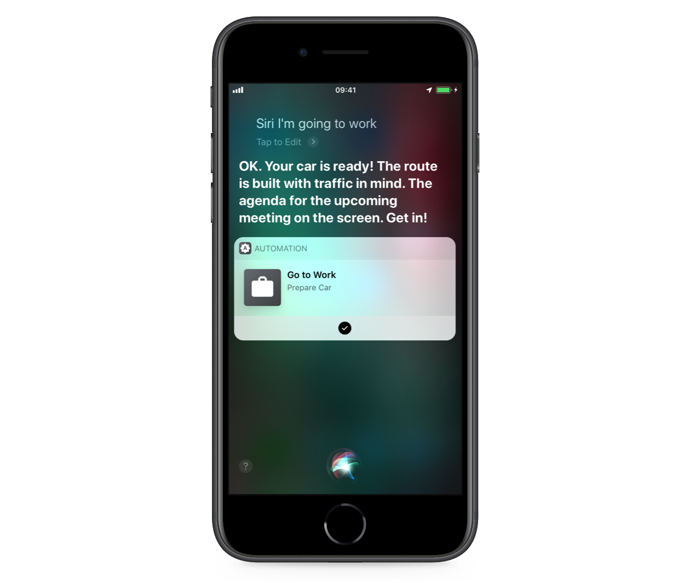

My idea and participation in the Hackathon from High Mobility in Tallinn. How it was, what I developed, what experience I got.

## Tallinn Mobility Hack

[The hackathon](https://mobilityhack.splashthat.com) organized by [High Mobility Team](https://company.high-mobility.com/about-us) took place in Tallinn, the capital of Estonia in November 2018. The goal of the hackathon was for software developers, designers and entrepreneurs to get a real feel for developing apps for connected cars using unlimited access to the [HIGH MOBILITY Developer Center](https://high-mobility.com/get-started). A platform for development and testing applications using vehicle emulators from the giants like Porsche and Mercedes-Benz. Also, there were cash prizes totaling €3000 for the winning teams.

> A __connected car__ is a car that is equipped with Internet access, and usually also with a wireless local area network. This allows the car to share internet access, and hence data, with other devices both inside as well as outside the vehicle. Often, the car is also outfitted with special technologies that tap into the internet or wireless LAN and provide additional benefits to the driver. — [Wikipedia](https://en.wikipedia.org/wiki/Connected_car)

## The Issue

Nowadays everybody seeks automation in day to day life. It's connected to accomplishing daily tasks, handling routine, etc. So everybody wants to be as much productive as possible. Especially it comes to managers, businessmen — people who really care about being efficient and productive. When we are talking about cars, there is a big space for improvements. Diagnostics, car preparations and management, etc.

## Solution

A potential solution to the problem above could be an app with a set of different commands, for example, for [Siri Shortcuts](https://support.apple.com/en-us/HT209055) on iOS. To be able to set up actions like “When a meeting ends, prepare the car for the next event in the iOS calendar (turn on the engine, get directions, tell the agenda when heading to the next event)”. We can think of really various scenarios. It would be useful to let a customer set up their own flows to benefit from this. Of course, the app could provide with a bunch of basic flows to start with.

## Business Model

There are different possibilities for monetizing this. Here are a few of them.

1. Better car configurations give additional features for the app. It means that when buying the latest [Mercedes S63](https://www.mercedes-amg.com/en/vehicles/s-class/coupe/s63.html) with the full configuration, you could get a full-blown app with all ever possible commands to control and set up your car to meet your specific needs.
1. Providing with premium in-app features. It fits well to car subscription services like [Mercedes-Benz Collection](https://collection.mbusa.com) or [Porsche Passport](https://www.porschepassport.com). So better tiers give you better features.
1. Integration with third-party services (e.g. Spotify, Trello, Google Calendar, Jira) to make work seamless and smooth. For instance, to be able to take a look at the agenda or continue accomplishing tasks on a bigger vehicle screen when heading to the next event on your schedule.

## Long-term Impact

It could have a fantastic impact on our lives what could be seen through these benefits.

- Reduction in the number of hours worked.
- Increased productivity.
- Increased happiness and satisfaction / reduced stress.
- The Future World is automated.

## Evolution

This idea can easily evolve into even wider life integration. I'm pointing out 3 cases.

1. __Machine Learning__ — giving personalized experiences, learning customer routines and real-time suggestions on what could also be automated.
1. __Integration__ with Voice Assistants, Home Pods, entrance cards, etc. There is an infinite number of different actions to perform. Parking your car when opening the house door, preparing your car when leaving work, preparing your car depending on mood, etc. The more available APIs, the more automated tasks.
1. __Autopilot__ — In case of autopilot cars, to be able to complete scenarios such as “Pick up my children from school and get them home”.

## Uniqueness

The idea of automation itself is not unique. Giant companies are working on their own implementations ([Porsche Connect](https://www.porsche.com/usa/connect/), [Apple CarPlay](https://www.apple.com/ios/carplay/)) as well as smaller startups. But it has a huge potential because of the possibilities it has. Now it only starts because connected cars are not very widespread.

## Implementation

During the hackathon I built [a simple app](https://github.com/ilyagru/AUTOmation) with a quite straightforward flow for a quick demo. I finished it myself in 24 hours and [presented](https://youtu.be/sf9PrNHGSPM?t=1292). The keynote is in the repo as well. Unfortunately, I had little time and was very worried.

The app has an integration with Siri to be able to use it with the Voice Assistant or Siri Shortcuts and automate your day to day tasks. There is even no any user interface needed. As a demo, it supports only one scenario — preparing a car to go to work with saying just a few words. After saying "_Siri, I'm going to work_" the commands (AutoAPIs used) are sent to the car and it will be prepared: the engine starts, the lights are active, the doors are unlocked, the agenda on the car's screen, the navi destination is set, the in-car temperature is set, and so on. In return Siri says that _your car is ready_.

  <iframe
    src="https://www.youtube.com/embed/jKCEpYybPuM?rel=0"
    allow="accelerometer; autoplay; encrypted-media; gyroscope; picture-in-picture"
    allowfullscreen>
  </iframe>

## Conclusion

Unfortunately, I didn't take any winning place with my idea. I was just said that the idea makes sense. Maybe my idea is not so good as other ones. But after the hackathon I learned that some of the projects were not just created in 24 hours and their teams had some collaborations (with exclusive access to other APIs) with the hosts before. I don't think it's a good approach to develop the market and attract new people, especially through hackathons. It's better at least warn other participants that bigger companies take part too and there are already some connections to prevent unfair competition. So in this case it would not be called "Hackathon".

However, I thank High Mobility for the event. It was well-organized. Tasty food and good drinks. I got a lot of experience and great pleasure meeting ambitious people, participating, and doing sightseeing in Tallinn.

To learn more about the winners and the event itself, take a look at the [Medium article](https://medium.com/high-mobility/tallinn-mobility-hack-apps-winners-and-prizes-193703f9a585) from the party-givers.
