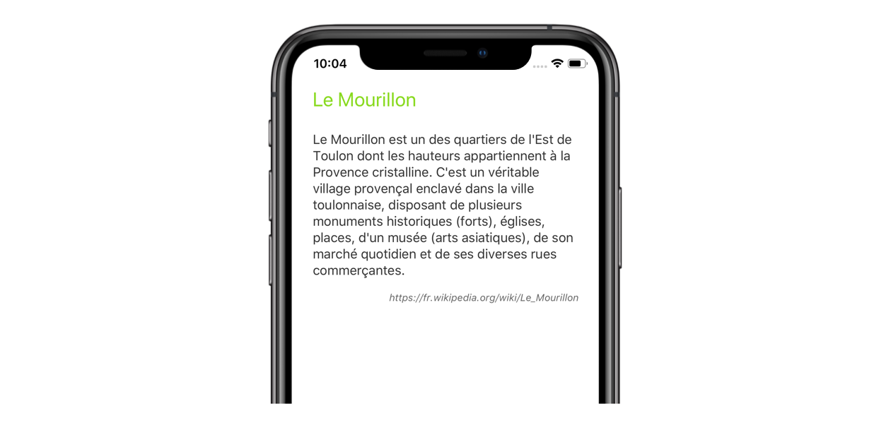

An interesting alternative to managing your `NSAttributedString`s in Swift projects. For those who know the CSS styles well.

## Motivation

It is just an interesting approach. Maybe for some of you it could be simpler since it seems that everybody knows the CSS styles by heart. Also, it could be useful if you need to share the same styles with the Frontend codebase. I think, there are some cases where it could be helpful, for example when we have a Wikipedia-like page or a document with different headers, different types of text.

## Classical approach

This is how it is done classically. We create `NSAttributedString` and then just add necessary attributes. It is clear that classical doesn't mean bad. It is typed at least.

```swift
let text = "Excusez-moi, ça ne vous embête pas que je vous observe une minute? Je veux me souvenir de votre visage pour mes rêves."

let font = UIFont.systemFont(ofSize: 24)
let paragraphStyle = NSMutableParagraphStyle()
paragraphStyle.firstLineHeadIndent = 4.0
paragraphStyle.alignment = .center

let attributes: [NSAttributedString.Key: Any] = [
    .font: font,
    .foregroundColor: UIColor.green,
    .paragraphStyle: paragraphStyle
]

let attributedText = NSAttributedString(string: text, attributes: attributes)
```

## CSSAttributedString approach

This is how you can do if you want to change the look of text with the help of CSS.

### Make us ready

First of all, you need to add a convenience `init` method to the `NSAttributedString` object. So you can initialize attributed strings in a simple way. Here I use the `<p></p>` tag because it is a basic text element. Don't forget that the tags could have the [default browser styles](http://trac.webkit.org/browser/trunk/Source/WebCore/css/html.css) like the default font for the text. In case of the `<p>`, it is a block element by default. It means that it always starts on a new line, and fills up the horizontal space to the left and right. Every next element will be rendered below.

```swift
extension NSAttributedString {

    convenience init(text: String, styles: [String: String]) {

        // Prepare a style string for passing to the HTML attribute
        // So the final value of the style attribute will look like this
        // "color: #000;font-size: 12px;font-family: Helvetica;font-style: italic"
        let style = styles.compactMap({ (property, value) -> String in
            return "\(property): \(value)"
        }).joined(separator: ";")

        // Initialize from the styled <p> HTML tag
        // We can force-unwrap this because in case of incorrect styles the string will be initialized anyway
        try! self.init(
            data: Data("<p style=\"\(style)\">\(text)</p>".utf8),
            options: [.documentType: NSAttributedString.DocumentType.html, .characterEncoding: String.Encoding.utf8.rawValue],
            documentAttributes: nil
        )
    }

}
```

So now you can create your styled strings like this. All the properties supported in Safari must be supported here as well! By the way, to use the same font as in iOS you can provide `-apple-system, system-ui` to the `font-family` property. So it will automatically use the San-Francisco font. It looks quite nice, huh?

```swift
let header = NSAttributedString(
    text: "This is a Header with CSS, hoorah!",
    styles: [
        "color" : "#89da20",
        "font-size": "24px",
        "font-family": "-apple-system, system-ui"
    ]
)
```

## Better structure

Of course, we can go further. We can prepare mappings for our headers, bodies, captions, etc. In case of complex content you can create a whole system for styling with flexbox, etc. I haven't tested all the CSS properties, so try your hand on.

```swift
enum Styles {
    static let header = [
        "color" : "#89da20",
        "font-size": "24px",
        "font-family": "-apple-system, system-ui"
    ]
    static let body = [
        "color" : "#333",
        "font-size": "16px",
        "font-family": "-apple-system, system-ui"
    ]
    static let caption = [
        "color" : "#666",
        "font-size": "12px",
        "font-family": "-apple-system, system-ui",
        "font-style": "italic",
        "text-align": "right"
    ]
}

let header = NSAttributedString(text: "Le Mourillon", styles: Styles.header)
let body = NSAttributedString(
    text: "Le Mourillon est un des quartiers de l'Est de Toulon dont les hauteurs appartiennent à la Provence cristalline. C'est un véritable village provençal enclavé dans la ville toulonnaise, disposant de plusieurs monuments historiques (forts), églises, places, d'un musée (arts asiatiques), de son marché quotidien et de ses diverses rues commerçantes.",
    styles: Styles.body
)
let caption = NSAttributedString(text: "https://fr.wikipedia.org/wiki/Le_Mourillon", styles: Styles.caption)
```



You can implement a concatenation method for `NSAttributedString`s, so you can join strings with the plus sign.

```swift
extension NSAttributedString {

    static func +(lhs: NSAttributedString, rhs: NSAttributedString) -> NSAttributedString {
        let concatenatedString = NSMutableAttributedString(attributedString: lhs)
        concatenatedString.append(rhs)

        return concatenatedString
    }

}

textView.attributedText = header + body + caption
```

## Conclusion

So simply experiment with this. And maybe you could find it a good fit to your project. However, have fun!

## References

1. [NSAttributedString Apple Documentation](https://developer.apple.com/documentation/foundation/nsattributedstring)
1. [W3Schools CSS reference](https://www.w3schools.com/cssref/)


