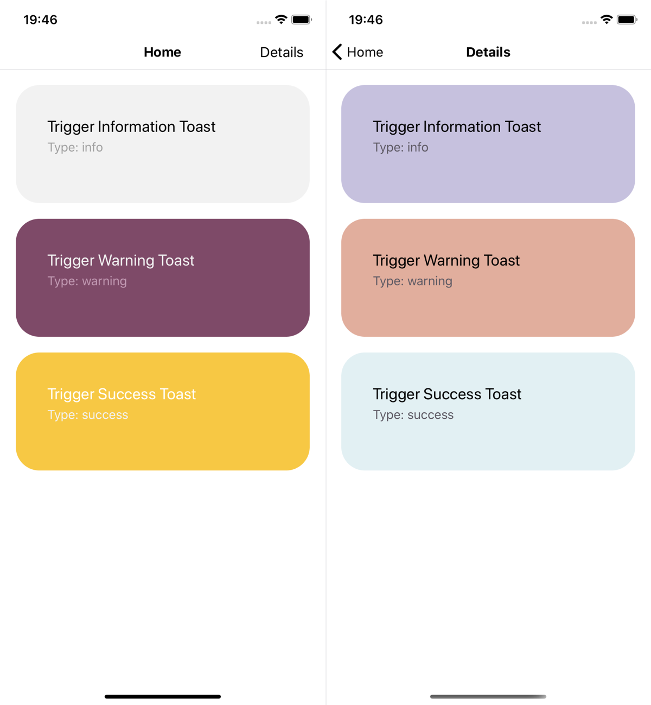

## Introduction

Toasts are lightweight notifications designed to mimic the push notifications. They have been popularized by mobile and desktop operating systems. They're used mainly internally, in-app to provide users with some feedback about errors, successfully completed actions, etc. There is plenty of techniques and different implementations, a lot of various packages to choose from. On the other hand, React introduced New Context API with version 16.3, which is quite robust and could be used in state management or even for displaying toasts.

So I'm going to share a cool concept on how to add a notification system to a React Native application using Context API without any third-party packages. Yes, I will be using React Native here, but the concept still applies to plain React for the Web.

## Let's start

### Setup

Let's set up a new project. I will be using a template with TypeScript, so you can see how it could be typed. Your environment should be prepared for React Native. You can look into the [official guide](https://facebook.github.io/react-native/docs/getting-started).

```bash
npx react-native init ToasterApp --template react-native-template-typescript
```

And then run it. React Native uses Yarn by default.

```bash
yarn ios
```

### Simple app

Let's remove the initial boilerplate code and set up a few simple screens using [react-navigation](https://reactnavigation.org/en) to demonstrate how we can display toasts on no matter which screen. In the docs you can find a well-described Hello React Navigation guide, just follow the steps to set up the bare minimum. In my case, the simple app looks like this.



It has 2 screens: **Home** and **Details**, from which we are going to trigger toasts.

## Context implementation

### Portal Context


Then let's define our Context. It will have `gates`. They can accept our components somewhere in the tree hierarchy, for the demo there will be only one gate available – `toaster`. Then a `teleport` function that can send a component to a gate (a toast to the root component, in our case), and the `showToast` function for convenience. In general, we can use the `teleport` function for moving not only toasts through our React hierarchy.

```typescript
// ./src/toaster/portalContext.tsx

export type ShowToastFunction = (message?: string, type?: ToastType) => void;
export type PortalContextProps = React.ContextType<typeof PortalContext>;
export type GateName = 'toaster';

interface IContextProps {
  gates: { [key: string]: ReactNode };
  teleport: (gateName: GateName, element: ReactNode) => void;
  showToast: ShowToastFunction;
}

export const PortalContext = createContext<IContextProps>({
  gates: {},
  teleport: () => {},
  showToast: () => {},
});
```

### Portal Provider

Next let's implement the business logic, for these purposes we create Portal Provider. With the the help of if, we can wrap our entire app and the logic will be available throughout the app.

```tsx
// ./src/toaster/portalProvider.tsx

interface IProviderProps {
  children: ReactNode;
}

interface IProviderState {
  gates: { [key: string]: ReactNode };
}

export class PortalProvider extends Component<IProviderProps, IProviderState> {
  public state = {
    gates: {},
  };

  public render() {
    return (
      <PortalContext.Provider
        value={{
          gates: this.state.gates,
          teleport: this.teleport,
          showToast: this.showToast,
        }}
      >
        {this.props.children}
      </PortalContext.Provider>
    );
  }

  private teleport = (gateName: GateName, element: ReactNode) => {
    this.setState(prevState => ({
      gates: { ...prevState.gates, [gateName]: element },
    }));
  };

  private showToast: ShowToastFunction = (
    message = 'Oh là là! There is an error!',
    type = ToastType.Error
  ) => {
    this.teleport('toaster', <Toast type={type}>{message}</Toast>);
  };
}
```

The Provider's state manages our gates and its components – exactly what we need. Under the hood the `teleport` function sets `gate`'s state value to a component that we would send.

And finally the `showToast` function which is just a convenient method for us. It will be using the defined earlier `teleport` function and will send our actual `<Toast />` component. There are 2 arguments: one for the message of the toast, the other for its type whether it's `error`, `info` or `success`, etc. By default it has a generic error.

### Portal Consumer

Then let's move to the Context Consumer. In fact, the Consumer is our Gate. Nothing special here, just a render prop that displays the sent component as children.

```tsx
// ./src/toaster/portalConsumer.tsx

interface IPortalConsumerProps {
  gateName: GateName;
  children?: (teleport: (gateName: GateName, element: ReactNode) => void) => ReactNode;
}

export const PortalConsumer = ({ gateName, children }: IPortalConsumerProps) => (
  <PortalContext.Consumer>
    {value => (
      <>
        {value.gates[gateName]}
        {children && children(value.teleport)}
      </>
    )}
  </PortalContext.Consumer>
);
```

### Bonus: useToaster hook

One more nice to have thing is a custom hook which we can use for getting the `showToast` function without repeating ourselves. It's pretty simple and returns just the Context's method. The method's signature is automatically typed! So sweeet!

```typescript
// ./src/toaster/useToaster.tsx

const useToaster = () => {
  const { showToast } = useContext(PortalContext);
  return useCallback(showToast, []);
};
```

## Enable the feature

Now we implemented everything that was necessary. Let's enable it for our app!

### Providing and Consuming

First wrap the app into `ContextProvider`. It should be at one level higher than the navigation, so we could see our toasts covering the app's navigation bar.

```tsx{5,8}
// ./App.tsx

const App = () => {
  return (
    <PortalProvider>
      <StatusBar barStyle="dark-content" />
      <RootStackNavigationContainer />
    </PortalProvider>
  );
};
```

Add the Gate for the toasts. It could be at the same level as our navigation – it is enough to display toasts on the navigation bar. Provide the name for the Gate, in this case it would be `toaster`.

```tsx{7}
// ./App.tsx

const App = () => {
  return (
    <PortalProvider>
      <StatusBar barStyle="dark-content" />
      <PortalConsumer gateName="toaster" />
      <RootStackNavigationContainer />
    </PortalProvider>
  );
};
```

### Teleporting

And finally we can use either `useToaster`, or even `contextType` (for class components) to trigger the much awaited toasts somewhere in the code. Let's add them to our screens!

#### Functional component

```tsx{4-7,11}
// ./src/navigation/screens.tsx

const HomeScreen = () => {
  const showToast = useToaster();
  // Or even without our custom hook we still can use the context directly,
  // showToast is typed and correct!
  // const { showToast } = useContext(PortalContext);

  return (
    <View style={styles.screen}>
      <Button onPress={() => showToast('Message', ToastType.Info)}>Trigger toast</Button>
      {/* Screen body ... */}
    </View>
  );
};
```

#### Class component

```tsx{4-6,11}
// ./src/navigation/screens.tsx

export class DetailsScreen extends Component<{}, {}> {
  public static contextType = PortalContext;
  // Necessary when using TypeScript, so this.context has correct types
  public context!: PortalContextProps;

  render() {
    return (
      <View style={styles.screen}>
        <Button onPress={() => this.context.showToast('Details message', ToastType.Info)}>
          Trigger toast
        </Button>
        {/* Screen body ... */}
      </View>
    );
  }
}
```

### Final touch

One more think left is to automatically clean up our toasts. It's necessary to clean our gates before sending new toasts since it could cause rendering issues. So don't forget to call `teleport` with `null` in the `onEndAnimation` callback.

```tsx{10-11}
// ./src/components/toast.tsx

private endAnimation = () => {
  const { animationXY, animationOpacity } = this.state

  Animated.parallel([
    // End animation...
  ]).start(() => {
    this.setState({ swipe: false })
    // We should clean up our toaster after the animation has ended
    this.context.teleport('toaster', null)
  })
}
```

## And voilà!

Take a look at the demo. It works on both screens!

<!-- TODO: Replace with React component -->
<p style="border-radius: 3px; overflow: hidden; line-height: 0; text-align: center;">
  <video controls style="max-width: 100%; max-height: 600px;">
    <source src="./toast-trigger.mp4" type="video/mp4" />
  </video>
</p>
<!-- <Video sourceUrl="./toast-trigger.mp4" title="Toast trigger" isIFramed={false} /> -->

## Conclusion

In my opinion, this one is pretty amazing way to implement toasts display in the app and in React. Feel free to play with it and maybe you could find it useful for another use case, not only for toasters. The repo with the code is available on my [GitHub](https://github.com/ilyagru/react-context-toaster-app). Happy teleporting!

<!-- TODO: Replace with React component -->
<p style="background-color: #f8f8fa; border-radius: 3px; line-height: 0;">
  <iframe
    allow="autoplay *; encrypted-media *;"
    style="overflow: hidden; background: transparent; min-height: 150px;"
    sandbox="allow-forms allow-popups allow-same-origin allow-scripts"
    src="https://embed.music.apple.com/us/album/%D1%82%D0%B5%D0%BB%D0%B5%D0%BF%D0%BE%D1%80%D1%82/1061990764?i=1061991212&app=music">
  </iframe>
</p>

_Sidenote: I spied the initial idea from [Naor Zruk](https://medium.com/@naorzruk/portals-in-react-native-22797ba8aa1b), but then improved it a little bit and adapted for Notification system. Thanks Naor for inspiring me!_
