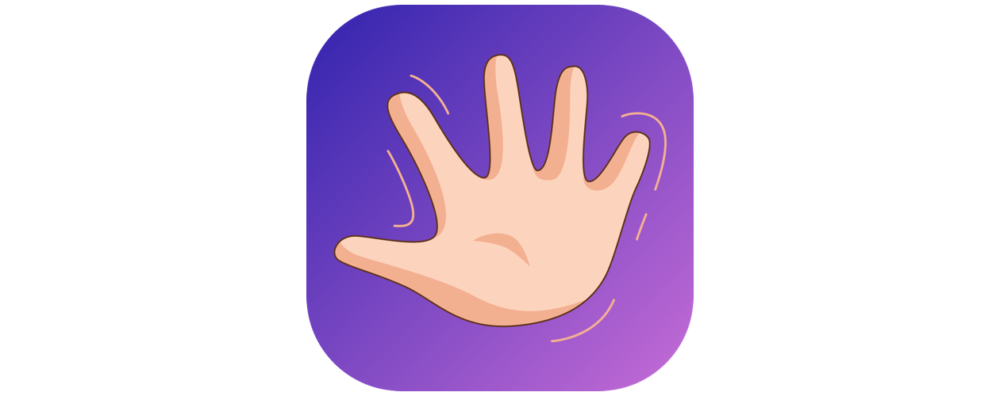

_Originally written April 20, 2017_

Hey. I will tell you how I made my first small app in Swift 3 in Xcode, launched and got into the TOP-25 paid applications of the Belarusian App Store, as well as on the 3rd place in the Productivity category. What I learned, what mistakes I made, what advice I can give.

## Prehistory

I have always been keen on mobile applications, especially since I started when buying 4th iPhone a few years ago, the newest was 4S and there wasn’t iOS7 version yet. I literally fell in love with the ecosystem of applications, especially on the Apple devices, this is done very well and besides, very profitable. A little later, I wanted to try creating an app by myself. But after a bit of research, I realized that without a Macintosh I couldn’t really do anything (I think the options with Hackintosh are foolish). Then I started a startup Movsea, went headlong into Web development, however, that’s another story… But later, I was finally able to buy myself a MacBook Pro 2015. I was extremely happy that I purchased this computer. So with it I began to explore iOS development step by step.

Earlier, I read books from Apple: [Swift](https://itunes.apple.com/us/book/the-swift-programming-language-swift-3-1/id881256329?mt=11), [iOS Human Interface Guidelines](https://developer.apple.com/ios/human-interface-guidelines/overview/design-principles/), etc. I also read a recently released [book from Apple](https://itunes.apple.com/us/book/intro-to-app-development-with-swift/id1118575552?mt=11) for practice and learning to program in Swift. It’s very cool! In each chapter there are practical tasks, as well as some guide to thinking about your own project. I also tried to take courses at [Udacity](https://udacity.com) (free and paid), but I personally did not like the presentation, and the material is rather superficial, so I looked through these courses very rapidly. On other platforms, courses are probably different. It’s worth mentioning that I had programming experience at the time of the start of mobile development, but still Web and native iOS developments are decently different things. Reading in English is not a problem for me.

## Preparations

I believe that if you want to learn something, then practice is the best teacher. I decided to make a small application completely by myself from the title to the release in the App Store. For several days I was choosing ideas, I stopped at an app for memorizing names, since I also have such a problem. In addition, for the first app it looked quite capable, since the logic of the app resembles the standard Todo list, of which there are a lot. It may not be the best idea to write down a name when meeting someone, but I tried to simplify the process as much as possible, and having a separate application for the sole purpose would focus you on the main mission — memorizing names.

Then I did a little research: I looked at the similar apps in the stores, searched on Google. The research showed that the problem really is and there are analogues, but aren’t of very high quality, even with good reviews. I decided to act — I made a plan, I minimally thought about the target audience, wrote out what was not in the analogues, or that I was not particularly happy with their apps, which would be nice to implement, I made a todo list. The name (Remame comes from _“REMember nAME”_ or like _“rename”_) was invented even earlier, as I keep a list of all the interesting ideas for business or apps that come to my mind, which I advise everyone.

## Design

I decided to make the design as simple and stylish as possible. I sketched and thought with Sketch. I really like this editor, it works simply, and the output is of high quality. I found the logo icon on photostocks and changed it a bit. Based on it, I made several stickers for iMessage.

In my opinion, it turned out to be quite good, since I also know something about design and sometimes I design or draw something.

I also learned that the design and prototypes of apps [can be done](https://developer.apple.com/videos/play/wwdc2016/805/) in the standard Keynote app from Apple. That’s very good news! By the way, there are a lot of useful resources on the Apple website itself. And it's worth mentioning Adobe Experience Design, if you don't want to pay for Sketch (at the time of writing it’s in beta testing and distributed for free).

## Programming

> And bingo!... It's working.

Then I started programming in Xcode. At first it was hard to understand the interface, because there is a lot of things. And I did not understand how to organize files and code in a project, although I am familiar with the concept of MVC. I had to go through Google and StackOverflow. Apple has a small tutorial on writing its first application. No need to panic if the appropriate code found on the Internet is Objective-C. There is a useful service for converting code from Objective-C to Swift 3.

The next challenge I encountered is Auto Layout. Probably, only the laziest novice mobile developer did not mention the difficulties with mastering this module. But over time it becomes easier to work with it. I looked here.

Further, the entries made in the application needed to be somehow stored on the device. There are several options here. I decided not to use any libraries and plugins for this and chose to learn standard tools. Like Core Data. I confess, dealing with Core Data and proper integration was one of the most difficult moments in the development. Moreover, at first, everything seemed to me simple and logical, but the real difficulty began when I wanted to introduce a widget for the Notification Center for the app. In the project, this is implemented as a separate module from the application itself (as well as stickers for iMessage, for example). The application itself with this widget should somehow communicate. In the development, App Groups are used for this. Core Data and refactoring took 4 days. That is, for four days in a row, with breaks only for sleep, I tried to connect the data storage, the application and the widget each other. As a result, I found a partially working code that did almost the same thing that I wanted. I tried to fix and inject it into my application, I even wrote to its creator. At first he told me something helpful. I made sure that this was the right way, but it still didn’t work as it should. I asked to contact him via Skype and tell me where and what I was doing wrong. To which he replied that he had no time. I was despondent, but did not give up. I spent a little more trying to adjust everything. And bingo! ... It's working. Of course, now I would maybe advise using easier solutions, for example, [Realm](https://realm.io) for storing data for your first app or dive into standard tools deeper.

Many difficulties were with the optional types in Swift. At first, you don’t understand where to put a question or exclamation mark, and where you don’t, but Xcode kindly helps with this.

I also added support for 3D Touch, handling locations, saving people in Contacts and simple animations. To deal with it, it’s not difficult with the ability to google.

The app was translated into 4 languages, there were few translations. This is not as difficult as it seems at first glance, especially as Xcode has everything for this. But also you need to understand.

## Publication and summary

There are many articles about publishing applications, so I will not describe the process. My application was approved from the first time within a day. I also learned that the app preview can be recorded using the QuickTime player and edited in iMovie, there is a special function for this. Everything is very intuitive and understandable, even for people with no experience in video editing.

  <iframe
    src="https://www.youtube.com/embed/77reFlMS6d8?rel=0"
    allow="accelerometer; autoplay; encrypted-media; gyroscope; picture-in-picture"
    allowfullscreen
  ></iframe>

In total, I spent 2 weeks on the code, but during this time I almost did not eat, I was very passionate. Then add time spent on the design, tests, filling [the profile in the App Store](https://itunes.apple.com/us/app/remame/id1186430894), etc. In general, it was about a month and the app is completely ready. I liked the process very much and learned a lot. Building the next application it will be many times easier. The products themselves, the tools to develop from Apple — all at a very high level. This is not like supporting IE8 on the web.

During the first two weeks, the application even managed to get into the TOP 25 paid apps of the Belarusian App Store, as well as to the 3rd place in the Productivity category, although it didn’t last long there. It helped to get there thanks to the local public figures and my friends.

## Tips that I didn’t mention

* Try to split the code into files as much as possible: if, for example, there is a lot of logic responsible for storing data, then put it into a separate file;
* There are two types of input fields in the interface: `UITextField` and `UITextView`. The second is used for multi-line text, only the first has the familiar “placeholder” property. Therefore, if you want to make a large input field with a placeholder, you will have to be wise. One solution is to create a text element on top of the field, which would disappear when entering text;
* The cell class `UITableViewCell` for the `UITableView` should always be created in a separate file;
* Start the promotion of an application at least 2 months before the release, even if you are not sure that you will publish it;
* You shouldn’t write to large editorial offices or Apple about advertising or promoting your first application - there’s little use for that. It’s better to post small reviews from bloggers or on social networking sites on relevant topics;
* Do not expect big earnings in the absence of investments and regular work, unless, of course, you have millions of subscribers in social networks. By the way, payments to developers occur only when more than $150 is earned for the financial month;
* Don't give up and get things done. Any problem has a good solution.

### More links that to one degree or another helped me

#### Tutorials

1. [A set](https://www.raywenderlich.com/category/ios) of articles and tutorials
2. Instagram Clone with Swift and Xcode ([video](https://www.youtube.com/watch?v=ixJhbYvJUTE))
3. iOS 10 Todo App with Core Data in Swift 3 ([video](https://www.youtube.com/watch?v=qt8BNhpEAok))
4. Core data [tutorial](https://www.raywenderlich.com/145809/getting-started-core-data-tutorial)
5. Customizing Navbar [tutorial](https://www.ioscreator.com/tutorials/customizing-navigation-bar-ios8-swift)
6. Location request [example](https://www.hackingwithswift.com/example-code/location/how-to-request-a-users-location-only-once-using-requestlocation)
7. Animation [tutorial](https://www.appcoda.com/view-animation-in-swift)
8. More animation [tutorial](http://mathewsanders.com/animations-in-swift-part-two/)
9. Animation ([video](https://www.youtube.com/watch?v=X4zcQacl4YU))
10. Localization ([video](https://www.youtube.com/watch?v=YpNU6HbkMjQ))
11. Contacts framework [tutorial](https://www.appcoda.com/ios-contacts-framework/)
12. Today widget for the Notification Center [example](https://mehulablog.wordpress.com/2016/10/02/ios-widget-today-extension-with-swift-3-0-language/)
13. Data exchange between apps and their extensions [tutorial](https://www.invasivecode.com/weblog/sharing-data-between-apps-and-their-extenstions/?doing_wp_cron=1481455581.6917309761047363281250)

#### App Store

1. Apple App Store [resources](https://developer.apple.com/app-store/)
2. Publishing a paid application [tutorial [RU]](https://spark.ru/startup/classicmemes/blog/12221/publikatsiya-svoego-prilozheniya-v-appstore)
3. ASO [tutorial [RU]](https://spark.ru/startup/aword/blog/18398/delaem-aso-dlya-novogo-mobilnogo-prilozheniya)

#### Promotion

1. [BetaList](https://betalist.com)
2. [BetaPage](https://betapage.co)
3. [Launching Next](http://www.launchingnext.com)
4. [Killerstartups](https://www.killerstartups.com)
5. [The list of medias](https://submit.co) from the BetaList team

### Results

1. [Remame app](https://itunes.apple.com/us/app/remame/id1186430894)
2. [Remame website](https://ilyagru.github.io/remame/)

Thank you very much to those who read to the end! I hope that my article turned out to be at least a little useful to you.
If you have any suggestions or questions, write to me via Telegram, I will try to answer. I also do Frontend development (I write in JavaScript, Vue.js, or React.js). I will be very grateful if you support me in my adventures by downloading Remame on the App Store.
