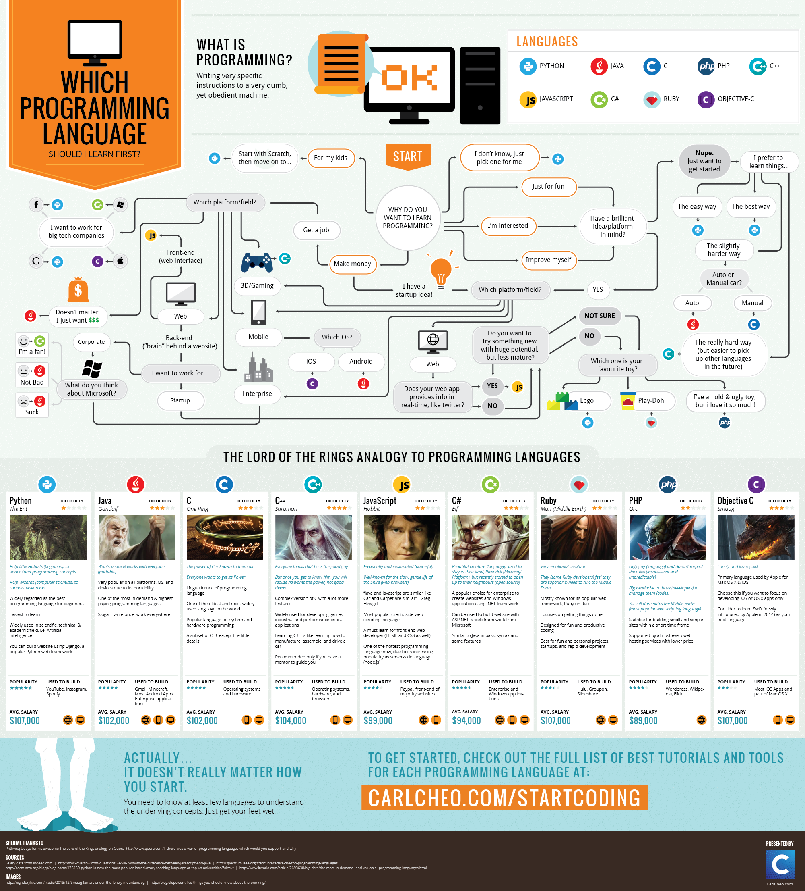
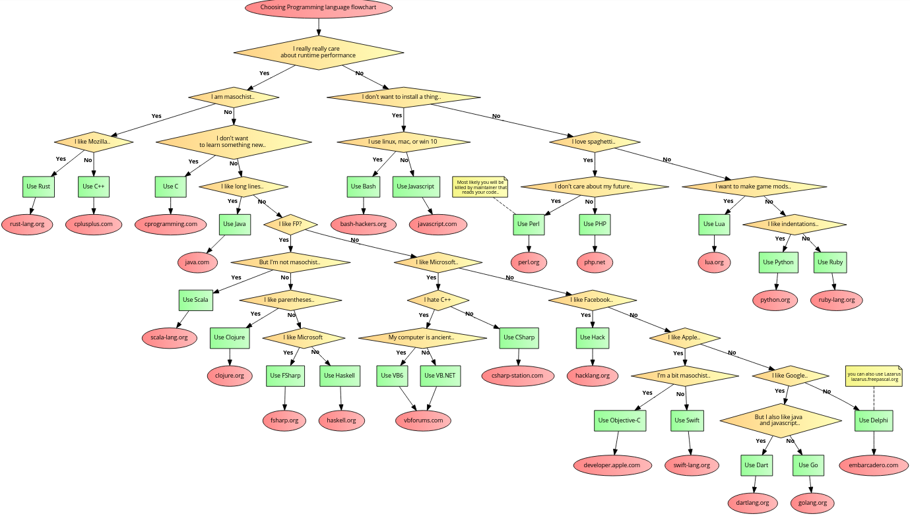
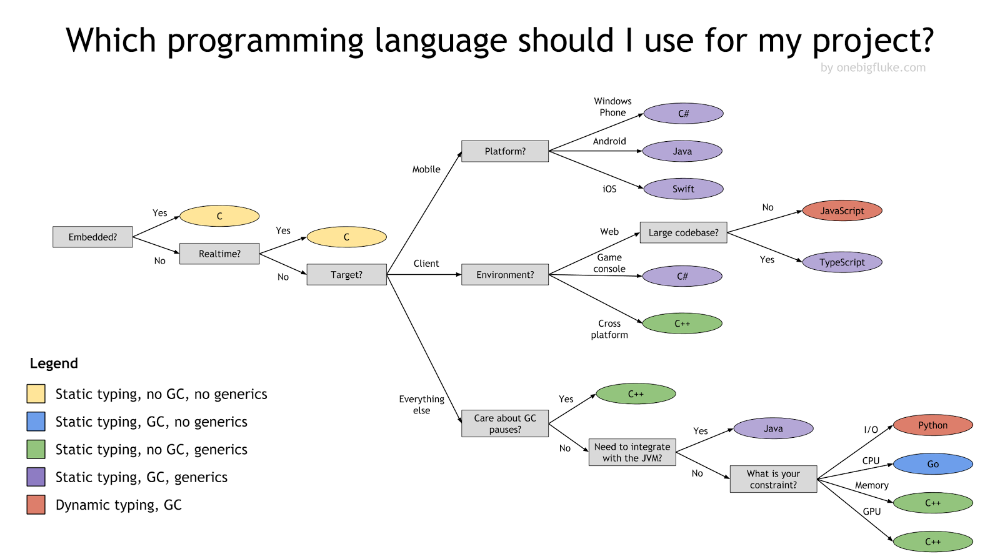

Some people ask me how to start doing some things in the programming world. So I decided to post some kind of answer with a few ideas to get you started. This is not the complete guide to programming.

## What we have

First of all, take a look at what you have, what you want to do, and why you want to be a programmer.

### Maybe iOS?

> “Everybody in this country should learn to program a computer, because it teaches you how to think” — Steve Jobs

For example, if you have a MacBook, I would advise you to try iOS apps. [Swift](https://swift.org) is wonderful to go here but you need some knowledge of Objected Oriented Programming principles, compilators, etc. But it's possible to learn it if you want. As I wrote in my [previous post](/remame-story) you can start with the books from Apple. They are very cool for the beginning and could give you more motivation. Then you can find others.

1. [The Swift Programming Language](https://itunes.apple.com/us/book/the-swift-programming-language-swift-4-2/id881256329) by Apple
1. [Intro to App Development with Swift](https://itunes.apple.com/us/book/intro-to-app-development-with-swift/id1118575552) by Apple
1. [App Development with Swift](https://itunes.apple.com/us/book/app-development-with-swift/id1219117996) by Apple
1. [PRO SWIFT](https://www.amazon.com/Pro-Swift-4-1-Paul-Hudson/dp/1985779781) by Paul Hudson

You can find a lot of courses on different websites. One of the most outstanding could be a Stanford course [Developing iOS 11 Apps with Swift](https://itunes.apple.com/pl/course/developing-ios-11-apps-with-swift/id1309275316). One of the coolest seems [Design+Code](https://designcode.io). Also there is a cool growth path for an iOS developer that I found and finished completely. It's just a recommendation but it covers a lot of things which every Apple developer should know. Available as a [Trello board](https://trello.com/b/dOV9dvBu/a-path-to-mastery-for-ios-development), so you can grab and copy it to your own board and complete challenges one after another. A bunch of cool tutorials are here on the [Ray Wenderlich website](https://www.raywenderlich.com).

One of the best solutions here could be implementing your own idea if you have one. It could be either a simple Todo list or something more complex. Even a mobile game but it could be difficult and you can get desperate. So do not rush!

### Maybe Frontend / Web?

If there is no Mac (or there is), then the Web development (at least creating simple websites), because it's very extensive and, in my opinion, there are more chances to specifically decide on further study. It is easy to start doing something and see the result almost at the same time. But it's not difficult to get lost and lose motivation. In this case, you need not to give up, it will pass when you know more.

For the web, I would advise to start as soon as possible with practice, while reading books in parallel and studying terminology. In fact, learn [HTML](https://www.w3schools.com/html/html_intro.asp) and [CSS](https://www.w3schools.com/html/html_css.asp). This is not really programming, but you can add [JavaScript](https://developer.mozilla.org/en-US/docs/Web/JavaScript). On the Internet, there are still many articles with a path you could take to become a JavaScript ninja or guru.

As for JavaScript, programming begins with it. If you don’t want to go all the way into site building, then you can go straight to JavaScript, in which case it would be better to use the Node.js ecosystem. On the Internet, there is a lot about it. Personally, for me online courses weren't so effective. It was more useful just to find different designs on the Internet, for example on [Dribbble](https://dribbble.com/search?q=landing+page), and try to implement them just looking. Increase the difficulty as you develop. Anyway, you could try these platforms.

1. [Khanacademy](https://www.khanacademy.org/computing/computer-programming)
1. [Cocecademy](https://www.codecademy.com)
1. [Html Academy [RU]](https://htmlacademy.ru)
1. [Learn to Code HTML & CSS](https://learn.shayhowe.com/html-css/)

For references

1. [HTML](https://htmlreference.io/)
1. [CSS](https://cssreference.io)
1. [JavaScript](https://javascript.info)
1. [W3C](https://www.w3schools.com) — This resource is quite fundamental, because in general, W3C is an organization that develops HTML and CSS standards.

There are a lot of guys who make videos. You just need to google it and choose your favorite. On English YouTube I would highly recommend this channel [The Net Ninja](https://www.youtube.com/thenetninja). He explains very clearly in spoken English. On Russian YouTube, [Sorax](https://www.youtube.com/artsorax).

The fundamentals can be found anywhere, just the basics are not a problem to find, the problems will begin when you want to go deep, because the quality and quantity of more advanced material is much lower. Then of course you can try single page applications, [React.js](https://reactjs.org), [Vue.js](https://vuejs.org) and [the family](https://2018.stateofjs.com).

For more JS and server-side JS you can take a look at these resources.

1. [JS-bits](https://github.com/vasanthk/js-bits)
1. [Learn You Node](https://github.com/workshopper/learnyounode)
1. [Nodeschool](https://nodeschool.io)
1. [JavaScript 30 Days Challenge](https://javascript30.com) — Here you can find other courses from [Wes Bos](https://wesbos.com)

As for Frontend books, I can advise these. Just look if there is a newer edition.

1. [Learning Web Design](https://www.learningwebdesign.com) by Jennifer Robbins
1. [CSS3 Big Book 3rd Edition](http://shop.oreilly.com/product/0636920024996) by David McFarland
1. [Web Design with HTML, CSS, JavaScript and jQuery Set](https://www.amazon.com/gp/product/1118907442/) by Jon Duckett
1. [CSS Secrets](https://www.amazon.com/CSS-Secrets-Lea-Verou/dp/1449372635) by Lea Verou
1. [HTML5 For Web Designers](https://html5forwebdesigners.com) by Jeremy Keith
1. [CSS3 For Web Designers](https://abookapart.com/products/css3-for-web-designers) by Dan Cederholm
1. [A Book Apart library](https://abookapart.com/products/) in total has many good books
1. [Head First JavaScript Programming](https://learning.oreilly.com/library/view/head-first-javascript/9781449340124/) by Elisabeth Robson, Eric T. Freeman
1. [JavaScript: The Good Parts](https://www.amazon.com/JavaScript-Good-Parts-Douglas-Crockford/dp/0596517742) by Douglas Crockford
1. [Web Development with Node and Express](http://shop.oreilly.com/product/0636920032977) by Todd Brown
1. [Front-end Developer Handbook 2018](https://legacy.gitbook.com/book/frontendmasters/front-end-developer-handbook-2018/details) by Frontend Masters

1. [More books](http://it-ebooks.info)
1. Even [more books](https://jsbooks.revolunet.com)

### Anything else?

You can try any other programming language, such as [Python](https://www.python.org) or [Ruby](https://www.ruby-lang.org/en/). They are mainly used for backend stuff. [Java](https://docs.oracle.com/javase/tutorial/index.html) and [Kotlin](https://kotlinlang.org) are needed for Android. Maybe some modern languages like [Go](https://golang.org), [R](https://www.r-project.org), or [Rust](https://www.rust-lang.org). I would not recommend touching the languages ​​of the [C](<https://en.wikipedia.org/wiki/C_(programming_language)>), [C++](http://www.cplusplus.com) family for a newcomer at all. There are a lot to choose from.

1. [The TOP programming languages 2018](https://spectrum.ieee.org/static/interactive-the-top-programming-languages-2018)
1. [What Programming Language Should a Beginner Learn in 2019](https://www.codementor.io/codementorteam/beginner-programming-language-job-salary-community-7s26wmbm6)
1. [What are Computer Programming Languages](https://www.computerscience.org/resources/computer-programming-languages/)

It's difficult to say here more because I don't have a lot of experience with other programming languages. Just try if it sounds interesting to you! There are a lot of articles and helping tools like [bestprogramminglanguagefor.me](http://www.bestprogramminglanguagefor.me/) throughout the Internet. These picture could also suggest a correct decision.

### Design

It would be mega useful for a developer to learn at least some basics of Design, in fact UI and UX. With this skill you could be even more effective and think more logically. A few useful resources and books to check out.

1. [All in One Bookmark Links for Designer](https://www.evernote.design) by Evernote
1. [Ebooks](https://www.uxpin.com/studio/ebooks/) by UXPin inc.
1. [The Principles of Beautiful Web Design](https://www.amazon.com/Principles-Beautiful-Web-Design-Designing-ebook/dp/B00TJ6UYZC) by Jason Beaird, James George
1. [Don't Make Me Think](https://www.amazon.com/Dont-Make-Me-Think-Usability/dp/0321344758) by Steve Krug

### English

Do not forget about your English. Of course if you're reading this there is no problem but I also would advise tightening up your English if there are any doubts about this. The main language of any programming is English. Only the laziest one isn't able to find anything here.

## Last words

I tried to help objectively — I hope I helped with something. Of course this list of resources could be much longer. The point is to understand which direction to go and what works best for you. For me, for example, the so-popular [Udemy](https://www.udemy.com), [Udacity](https://eu.udacity.com), or [Coursera](https://www.coursera.org) do not work. It's necessary to try little by little and understand what is interesting and beneficial and what is not. For motivation, it is important to have some kind of achievable goal, for example, to translate your sore idea into an application, start a startup or get a high-paying job and have goals in the course of training, such as reading 50 books, 20 pages, etc. It is really important to have self-discipline and develop a habit of doing something every day, at least a small part. I like habit-forming apps like these. But they should be just an addition to the main learning resource. There are a lot of variations with various languages for all the platforms.

1. [Enki](https://www.enki.com)
2. [Mimo](https://getmimo.com)
3. [TapCoding](http://tapcoding.com)
4. [Encode](https://itunes.apple.com/us/app/encode-learn-to-code/id1198851756)

[Duolingo](https://www.duolingo.com) and [Lingvist](https://lingvist.com) for natural languages, [Vanido](https://vanido.io) for singing, etc. And do not be afraid to ask for help from the more experienced developers, many are responsible and can help with anything. **Good luck!**
