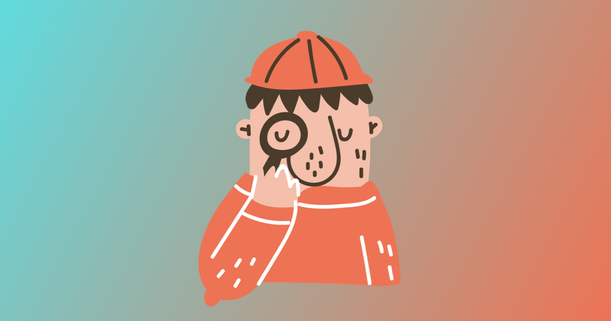

## Self-isolation



Yeah, the coronavirus is making all of us stay at home for long time. Many of us, if not everybody, are sitting in front of a laptop screen, iPhone or TV. That really impacts our vision and could cause eye fatigue, in chronic cases even syndrome of computer vision. It is a common issue for developers, designers or just remote workers. So take a piece of advice for improving your eye health.

## Ways of Eye Protection

### Workplace Setup

Set up your screen so your eyes are at the same level with the top of the monitor. You look slightly down at the screen. It is helpful to avoid glare from windows and lights. Use an anti-glare screen if needed. Also, screen brightness should be adjusted to surrounding lighting.

### Breaks and Exercises

It is quite crucial to take regular breaks, at least every 2 hours. Just get up and go to a window for a minute. For eye pauses, the period should be less. At least every 20 min or 1 hour you better blink to avoid dry eyes. There is a plenty of different reminders for every operating system or browser like [Breaks For Eyes](https://apps.apple.com/pl/app/breaks-for-eyes-rest-on-time/id1439431081?mt=12), [eyeCare](https://chrome.google.com/webstore/detail/eyecare-protect-your-visi/eeeningnfkaonkonalpcicgemnnijjhn?hl=en), [Awareness](http://iamfutureproof.com/tools/awareness/), etc. For mobile apps the same story, I guess.

I even created a simple reminder for myself. If you're wondering how? All you need is to place a file named `com.eyeprotection.eyerestreminder.plist` into `~/Library/LaunchAgents/`. It can have the following contents. The file is a simple instruction for macOS to display a notification every 1 hour. It uses [osascript](https://ss64.com/osx/osascript.html) for displaying notifications.

```xml
<?xml version="1.0" encoding="UTF-8"?>
<!DOCTYPE plist PUBLIC "-//Apple//DTD PLIST 1.0//EN" "http://www.apple.com/DTDs/PropertyList-1.0.dtd">
<plist version="1.0">
<dict>
  <key>Label</key>
  <string>com.eyeprotection.eyerestreminder</string>
  <key>ProgramArguments</key>
  <array>
    <string>sh</string>
    <string>-c</string>
    <string>osascript -e &apos;display notification &quot;Take a quick brake and let your eyes rest a bit.&quot; with title &quot;Eye Gymnastics!&quot; sound name &quot;Submarine&quot;&apos;</string>
  </array>
  <key>RunAtLoad</key>
  <true/>
  <key>StartCalendarInterval</key>
  <dict>
    <key>Hour</key>
    <integer>0</integer>
  </dict>
  <key>StartInterval</key>
  <integer>3600</integer>
</dict>
</plist>
```

Actually, you can use [Launch Agents](https://developer.apple.com/library/archive/documentation/MacOSX/Conceptual/BPSystemStartup/Chapters/CreatingLaunchdJobs.html) for other background tasks to introduce some automation, for example to [clean up the Downloads folder](https://thoughtbot.com/blog/example-writing-a-launch-agent-for-apples-launchd) and so on.

### Warmer Screen Colors

There is a cool app [f.lux](https://justgetflux.com) that makes the screen adapt to the time of the day, e.g. warmer at night. I think this app is a must-have for everybody who has a computer.

### Consider Computer Glasses

For the greatest comfort at your screen, it is recommended to wear computer glasses, you might need to ask your eye doctor to modify your eyeglasses prescription to have that blue screen protection or get non-prescription computer glasses. Anyway, consult a doctor for better results.

## You Can Do Even More

Don't forget to exercise. You can use an app like [Streaks Workout](https://streaksworkout.com) if you need some motivation. There is a lot of apps for meditation and yoga too. Just try to do it regularly to stay a in a good shape while all gyms are closed.

Stay safe!
