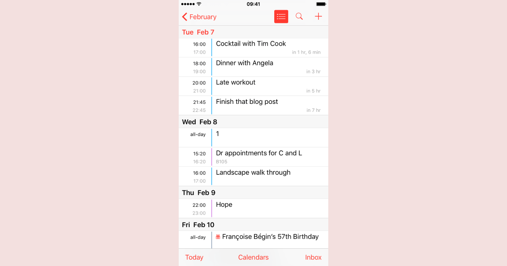

## Assignment

Imagine we have a React Native app and let’s say that we wanted to display a list of events in a form of the week view, where each week should have its header with start date or number of the week and exactly 7 days. Each day could have a number of events (no events at all or a few). Additionally, it would be useful to make it a generic component to be able to reuse it if we want to display a week view with another type of data e.g. todos.



So let's take a closer look!

## Prerequisites

- React Native app (v0.63.2 used in this guide)
- TypeScript (3.9.7)
- Moment and `lodash.range` (just for simplicity, can be replaced)

## Prepare the Ground

### Generic Types

First, let's start with a few types. `SectionListDay<T>` represents the day in the week. And `SectionListWeek<T>` represents the week, seven days. Since we need to be able to distinguish weeks one from another, we also have a title for each week. It is just a date that can be formatted in the UI later.

```typescript
export type SectionListDay<T> = { [k in keyof T]: T[k] } & { date: Moment };
export type SectionListWeek<T> = {
  title: Moment;
  data: Array<SectionListDay<T>>;
};
```

By the way, our model for the data is the following.

```typescript
export interface Event {
  id: number;
  name: string;
  start: Moment;
  end: Moment;
}
```

### Transform

Then, let's create our generic build/transform function which takes an object of data, e.g. `events` and outputs basically a section which then would perfectly match the `SectionList`'s `sections` prop. The helper might not be perfect, feel free to play with it. In conjunction with proper testing, it will do its work. The principal idea here is to be able to assign different types of data to the day and make the whole module typed.

```typescript
import moment, { Moment } from 'moment';
import { range } from 'lodash';

const DAYS_IN_WEEK = 7;

/**
 *
 * Builds a week of 7 days of provided structure e.g. `{ events: Event[] }` starting from `startDate`.
 * There is a requirement for items to have the `start` property, so it could be moved to its day.
 */
export function buildSectionListData<T extends { [key: string]: Array<{ start: Moment }> }>(
  items: T,
  startDate: Moment
): SectionListWeek<T> {
  const week = {
    title: startDate,
    data: range(DAYS_IN_WEEK).map(day => {
      // Increment startDate by one day with every new day
      const dayDate = startDate
        .clone()
        .add(day, 'day')
        .set('hour', 0)
        .set('minute', 0);

      const keys = Object.keys(items); // e.g. ['events']
      const dayItems = Object.assign({}, ...keys);

      // Assign each array of items to its corresponding day
      keys.forEach(key => {
        dayItems[key] = items[key].filter(item => moment(item.start).date() === dayDate.date());
      });

      return {
        date: dayDate,
        ...dayItems,
      };
    }),
  };

  return week;
}
```

## Usage

Using the above, let’s now define screen-specific types which would be the foundation of the list component.

```typescript
export type EventsDay = SectionListDay<{ events: Event[] }>;
export type EventsWeek = SectionListWeek<EventsDay>;
```

And finally, we use our types and transformer to create the Events screen. For the sake of simplicity, I make the component receive events through the prop but of course, they could be fetched and transformed dynamically with the `useEffect` hook, for example.

```tsx
const EventsScreen = ({ events }: Props) => {
  const [startDate, setStartDate] = useState(moment());
  // The initial value is the array of one built section.
  const [sections, setSections] = useState<EventsWeek[]>([buildSectionListData({ events }, startDate)]);

  return (
    <Screen>
      {/* `SectionList` is a generic component, in our case it is of type `EventsDay`. */}
      <SectionList<EventsDay>
        stickySectionHeadersEnabled
        sections={sections}
        {/* The item is the day which have its own data. */}
        renderItem={({ item }) => <EventsListItem day={item} />}
        renderSectionHeader={({ section }) => <WeekHeader date={section.title} />}
        SectionSeparatorComponent={() => <ListSeparator />}
        ItemSeparatorComponent={() => <ListSeparator />}
        keyExtractor={(item, index) => `id-${item.date.toISOString()}-${index}`}
      />
    </Screen>
  );
};
```

Just look how simple it is. The whole complex component is now correctly typed. Moreover, we could effortlessly reuse the same transformation logic.

## Next Steps

Based on that, we could go further, for example if the day should consist of user-created todos along with events. It is just as easy, define new day and week types and provide raw data `{ events, todos }` to the build function.

```typescript
export type ScheduleDay = SectionListDay<{ events: Event[]; todos: Todo[] }>;
export type ScheduleWeek = SectionListWeek<ScheduleDay>;

const scheduleSection = buildSectionListData({ events, todos }, startDate);
```

The above is arguably very logical. A week (section) consists of 7 days, and a day contains its own events. One more cool side of it is that we don't need to hassle with custom logic for week headers or inventing how data should be divided into weeks. Although I haven't covered the pull-to-refresh feature, navigating by weeks, etc., it could be introduced without an any issue. The UI could be anything and is on you. It shouldn't be difficult at all even to create a higher-level generic `ListScreen` component! Feel free to experiment with all this. The most important thing is that it is now scalable, testable and really usable.

Thanks for reading!
